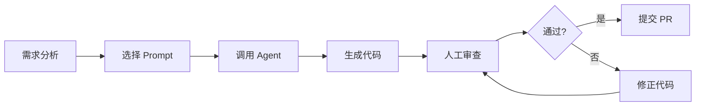
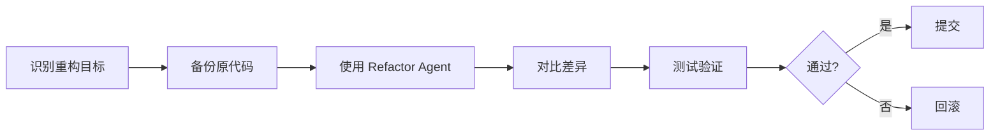
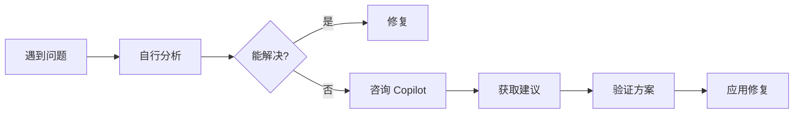

# FundWatcher - 企业级 Copilot 使用规范

> 版本：v1.0  
> 更新日期：2026-02-04  
> 适用项目：FundWatcher 及类似前端项目

---

## 📋 目录

1. [规范概述](#规范概述)
2. [角色与职责](#角色与职责)
3. [Copilot 能力矩阵](#copilot-能力矩阵)
4. [标准工作流](#标准工作流)
5. [质量控制](#质量控制)
6. [最佳实践](#最佳实践)
7. [反模式警示](#反模式警示)
8. [审查清单](#审查清单)

---

## 规范概述

### 目标

建立一套**可预测、可审查、可复用**的 AI 辅助开发体系，确保：

- ✅ 代码质量稳定
- ✅ 团队协作高效
- ✅ 知识可沉淀复用
- ✅ AI 输出可控可信

### 核心原则

1. **AI 是工具，不是决策者** - 所有 AI 生成代码必须经过人工审查
2. **规范先行** - 先定义规范和约束，再使用 AI
3. **渐进式采用** - 从低风险场景开始，逐步扩大应用范围
4. **持续优化** - 定期回顾 AI 生成代码质量，优化 instructions/prompts

---

## 角色与职责

### 开发者（Developer）

**职责：**
- 使用 Copilot 辅助日常开发
- 遵循项目 instructions 和 prompts
- 审查和修正 AI 生成代码
- 报告 AI 生成代码的问题

**权限：**
- ✅ 使用所有 agents/skills/prompts
- ✅ 修改自己编写的代码
- ❌ 直接修改 `.github/copilot-instructions.md`

### Tech Lead / 架构师

**职责：**
- 维护项目 instructions 和 prompts
- 设计和创建新的 agents/skills
- 审查 AI 生成的架构性代码
- 制定 AI 使用边界和安全规范

**权限：**
- ✅ 修改所有 Copilot 配置文件
- ✅ 批准新的 agents/skills 上线
- ✅ 定义代码审查标准

---

## Copilot 能力矩阵

### 适用场景（推荐使用）

| 场景 | 使用方式 | 审查级别 |
|------|----------|----------|
| 创建新组件 | `/fund-frontend create-component` | ⚠️ 中等 |
| 重构现有代码 | `/fund-refactor refactor-hook` | 🔴 高 |
| 添加类型定义 | Inline Copilot | ✅ 低 |
| 编写单元测试 | `/fund-testing generate-tests` | ⚠️ 中等 |
| 性能优化 | `/fund-refactor optimize-performance` | 🔴 高 |
| 文档生成 | Copilot Chat | ✅ 低 |

### 限制场景（慎用或禁用）

| 场景 | 原因 | 替代方案 |
|------|------|----------|
| 安全相关代码 | AI 可能引入漏洞 | 人工编写 + 安全审查 |
| 复杂状态管理 | AI 理解不足 | 先设计后实现 |
| 修改 Vite 配置 | 关键配置易出错 | 人工修改 + 文档参考 |
| API 密钥处理 | 敏感信息泄露风险 | 人工处理 |

---

## 标准工作流

### 工作流 1：创建新功能组件



**步骤详解：**

1. **需求分析**
   - 明确组件功能和边界
   - 确认是否符合项目架构
   
2. **选择 Prompt**
   - 使用 `/fund-frontend create-component`
   - 提供必要参数（组件名、props、功能描述）

3. **调用 Agent**
   - Agent 自动应用 instructions
   - 生成符合项目规范的代码

4. **人工审查**（必须！）
   - 检查类型安全
   - 验证样式符合设计
   - 确认无硬编码和魔法数字

5. **提交 PR**
   - 使用审查清单（见下文）
   - 标注 "AI-Generated" 标签

---

### 工作流 2：重构现有代码



**关键点：**
- 重构前必须有测试覆盖
- 使用 git diff 仔细对比
- 分小步骤提交，避免大范围修改

---

### 工作流 3：问题排查



**使用原则：**
- Copilot 用于提供思路，不直接采纳方案
- 优先查阅项目文档和外部文档
- 记录有价值的 AI 建议到 README

---

## 质量控制

### 代码审查标准

#### 自动检查（必须通过）

```bash
# TypeScript 类型检查（当前项目使用 build 脚本）
npm run build

# ESLint 规则检查
npm run lint
```

> 若已配置测试框架与脚本，再执行 `npm run test`。

#### 人工审查（关键项）

**类型安全：**
- [ ] 无 `any` 类型（除非有充分理由）
- [ ] Props 有完整 TypeScript 定义
- [ ] API 响应有类型守卫

**代码风格：**
- [ ] 符合 `.github/copilot-instructions.md` 规范
- [ ] 涨红跌绿颜色语义正确
- [ ] CSS 类命名符合 BEM 或项目约定

**性能与安全：**
- [ ] 无不必要的 re-render
- [ ] LocalStorage 操作有错误处理
- [ ] 无敏感信息硬编码

**可维护性：**
- [ ] 代码逻辑清晰，有必要注释
- [ ] 组件职责单一
- [ ] 可复用性良好

---

### AI 生成代码标记

在 PR 中使用标签标识 AI 生成部分：

```markdown
## Changes

### AI-Generated ✨
- 新增 `TrendChart.tsx` 组件（使用 `/fund-frontend create-component`）
- 重构 `useFunds.ts` Hook（使用 `/fund-refactor refactor-hook`）

### Manual 🖊️
- 修复涨跌颜色反转问题
- 调整 Vite 代理配置
```

---

## 最佳实践

### 1. 充分利用 Instructions

**项目 instructions 是 AI 行为的基准**。确保：

- ✅ Instructions 包含所有架构约束
- ✅ 技术栈、颜色语义等关键信息明确
- ✅ 定期更新，反映最新项目状态

**示例：**

```markdown
# .github/copilot-instructions.md

## 涨跌颜色规范（关键！）
中国股市惯例：涨红跌绿
- 上涨: #dc2626 (红色)
- 下跌: #16a34a (绿色)
```

---

### 2. 模块化使用 Prompts

**不要重复描述相同需求**，将常见任务封装为 Prompt：

**反例（低效）：**
```
Copilot: 帮我创建一个 React 组件，需要 TypeScript、函数式、Props 有类型...
```

**正例（高效）：**
```
/fund-frontend create-component ComponentName
```

---

### 3. 渐进式 AI 辅助

**从简单到复杂，从低风险到高风险：**

```
Level 1: 代码补全 → 自动导入
Level 2: 生成测试 → 生成类型定义
Level 3: 创建新组件 → 添加新功能
Level 4: 重构代码 → 性能优化
```

**禁止跳级！** 在 Level 1-2 熟练前，不要使用 Level 4。

---

### 4. 建立反馈循环

**持续优化 AI 使用效果：**

1. **记录问题**
   - AI 生成错误代码 → 记录到 Issues
   - 重复修正同类问题 → 更新 Instructions

2. **优化 Prompts**
   - 发现通用任务 → 创建新 Prompt
   - Prompt 参数不够用 → 增加可配置项

3. **分享经验**
   - 好的 AI 使用案例 → 写入文档
   - 避坑经验 → 加入反模式列表

---

## 反模式警示

### ❌ 反模式 1：盲目信任 AI

**表现：**
- 不审查直接提交 AI 生成代码
- 遇到错误时反复让 AI 修正，陷入死循环

**正确做法：**
- 所有 AI 代码必须人工审查
- AI 修正 2 次未解决 → 人工介入

---

### ❌ 反模式 2：过度依赖 AI

**表现：**
- 简单逻辑也要问 AI
- 不阅读文档，直接让 AI 解释

**正确做法：**
- 优先查阅项目文档和官方文档
- AI 用于辅助理解，不替代学习

---

### ❌ 反模式 3：忽略项目规范

**表现：**
- AI 生成代码不符合项目风格
- 涨跌颜色错误、类型定义缺失

**正确做法：**
- 维护完善的 `.github/copilot-instructions.md`
- 代码审查时严格检查规范遵循

---

### ❌ 反模式 4：无版本控制意识

**表现：**
- 大范围 AI 重构，无法回滚
- 多文件修改混在一个 commit

**正确做法：**
- 重构前先提交当前稳定版本
- 分模块、分功能小步提交

---

## 审查清单

### PR 提交前自查

```markdown
## AI 代码审查清单

### 基础检查
- [ ] 代码通过 TypeScript 编译
- [ ] 通过 ESLint 检查

### 功能验证
- [ ] 功能符合需求描述
- [ ] 边界情况已测试（空数据、错误状态等）
- [ ] 浏览器控制台无错误和警告

### 代码质量
- [ ] 无 `any` 类型（或有充分理由）
- [ ] 无硬编码的魔法数字和字符串
- [ ] 涨跌颜色语义正确（涨红跌绿）
- [ ] LocalStorage 操作有错误处理

### 性能与安全
- [ ] 无不必要的 re-render
- [ ] API 调用有错误处理
- [ ] 无敏感信息泄露

### 可维护性
- [ ] 代码逻辑清晰易懂
- [ ] 复杂逻辑有注释说明
- [ ] 组件职责单一
```

---

### Code Review 审查要点

**作为 Reviewer 审查 AI 生成代码时：**

1. **问自己三个问题：**
   - 这段代码我能看懂吗？
   - 如果出 bug，我能快速定位吗？
   - 这段代码符合项目架构吗？

2. **重点关注：**
   - 类型安全（特别是 API 响应处理）
   - 错误处理（网络请求、JSON 解析等）
   - 性能问题（不必要的计算、渲染）

3. **严格执行：**
   - 不符合规范 → 要求修改
   - 逻辑不清晰 → 要求重写
   - 有安全风险 → 禁止合并

---

## 使用示例

### 示例 1：创建新组件

```bash
# 步骤 1: 使用 Agent 生成组件
/fund-frontend create-component TrendChart \
  --props "fundCode: string, data: FundData[]" \
  --description "显示基金趋势图表"

# 步骤 2: 审查生成代码
# 检查：类型定义、样式、性能

# 步骤 3: 运行检查
npm run build
npm run lint

# 步骤 4: 提交
git add src/components/TrendChart.tsx
git commit -m "feat: add TrendChart component (AI-generated)"
```

---

### 示例 2：重构 Hook

```bash
# 步骤 1: 备份当前代码
git commit -am "chore: backup before refactor"

# 步骤 2: 使用 Refactor Agent
/fund-refactor refactor-hook useFunds \
  --focus "extract API logic"

# 步骤 3: 对比差异
git diff src/hooks/useFunds.ts

# 步骤 4: 测试（如已配置测试脚本）
npm run test

# 步骤 5: 确认无问题后提交
git commit -am "refactor: extract API logic from useFunds (AI-assisted)"
```

---

## 附录

### 相关文档

- [项目 Instructions](.github/copilot-instructions.md)
- [Agents 说明](.github/agents/README.md)
- [Skills 说明](.github/skills/README.md)
- [Prompts 说明](.github/prompts/README.md)

### 问题反馈

遇到 AI 相关问题，请在项目 Issues 中使用标签：
- `ai-bug`: AI 生成代码有 bug
- `ai-improvement`: AI 使用体验优化建议
- `ai-question`: AI 使用咨询

---

## 版本历史

- **v1.0** (2026-02-04): 初始版本，定义基础规范和工作流

---

**记住：Copilot 是强大的工具，但代码质量的最终责任在人。**
