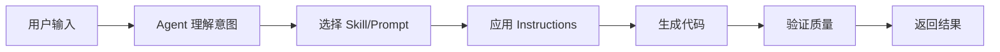

# Agents - AI 智能执行器

Agents 是目标导向的 AI 执行器，能够理解用户意图、选择合适的工具（Skills/Prompts），并执行多步骤任务。

## 📋 可用 Agents

### 1. Frontend Agent
**文件**: [frontend.agent.md](./frontend.agent.md)

**职责**:
- 创建新的 React 组件
- 实现 UI 功能和交互
- 处理样式和响应式设计
- 应用项目特定规范（涨红跌绿等）

**使用场景**:
```bash
/fund-frontend create-component ComponentName \
  --props "prop1: Type1, prop2: Type2" \
  --description "功能描述"
```

---

### 2. Refactor Agent
**文件**: [refactor.agent.md](./refactor.agent.md)

**职责**:
- 重构现有代码结构
- 提取自定义 Hook
- 优化性能（memo、useMemo、useCallback）
- 改进代码可维护性

**使用场景**:
```bash
/fund-refactor refactor-hook HookName \
  --focus "Extract API logic" \
  --preserve "LocalStorage behavior"
```

---

### 3. Testing Agent
**文件**: [testing.agent.md](./testing.agent.md)

**职责**:
- 生成组件单元测试
- 生成 Hook 测试
- 创建 Mock 数据和工具
- 提升测试覆盖率

**使用场景**:
```bash
/fund-testing generate-tests ComponentName \
  --coverage "all scenarios" \
  --mockData true
```

---

## 🔧 Agent 工作原理



### Agent vs 直接使用 Copilot

| 特性 | Agent | 直接使用 Copilot |
|------|-------|-----------------|
| 上下文理解 | 深度理解项目规范 | 通用建议 |
| 工具选择 | 自动选择最佳工具 | 需人工判断 |
| 多步骤执行 | 支持复杂流程 | 单次交互 |
| 一致性 | 始终遵循项目规范 | 可能不一致 |

---

## 📐 创建新 Agent

### 文件格式

```markdown
---
description: 'Agent 简要描述'
tools: []
---

# Agent Name

## Purpose
明确说明 Agent 的职责范围

## When to Use
列举适用场景

## Constraints
明确不做什么（边界）

## Inputs
期望的输入参数

## Expected Output
输出格式和内容

## Workflow
执行流程说明

## Quality Standards
质量检查标准

## Example Usage
实际使用示例
```

### 命名约定

- 文件名: `name.agent.md`（小写，用连字符分隔）
- Agent 名称: 简洁明确，体现职责
- 示例: `frontend.agent.md`, `refactor.agent.md`, `testing.agent.md`

---

## 🎯 最佳实践

### 1. 明确职责边界

**好的 Agent**:
- 职责清晰单一
- 边界明确（列出不做什么）
- 输入输出规范

**避免**:
- 大而全的 Agent
- 职责重叠
- 边界模糊

---

### 2. 提供丰富示例

**好的示例**:
```bash
# 具体的调用命令
/fund-frontend create-component TrendChart \
  --props "fundCode: string, data: FundData[]" \
  --description "显示基金趋势图"

# 期望的输出
生成 src/components/TrendChart.tsx
包含: TypeScript 类型、函数组件、样式结构
```

**避免**:
- 抽象的描述
- 缺少参数说明
- 没有输出示例

---

### 3. 关联相关资源

每个 Agent 应链接到:
- 相关 Skills（Agent 可能调用的工具）
- 相关 Prompts（Agent 可能使用的模板）
- 项目 Instructions（全局规范）
- 代码示例（参考实现）

---

## 🔍 Agent 调用流程

### 步骤 1: 用户调用 Agent

```bash
/fund-frontend create-component TrendChart \
  --props "fundCode: string, data: FundData[]"
```

### 步骤 2: Agent 理解意图

- 解析参数
- 识别任务类型
- 检查可行性

### 步骤 3: Agent 选择工具

- 根据任务选择合适的 Skill
- 可能使用 Prompt 模板
- 应用 Instructions 约束

### 步骤 4: Agent 执行任务

- 生成代码
- 应用项目规范
- 进行质量检查

### 步骤 5: Agent 返回结果

- 提供完整代码
- 说明关键决策
- 建议验证步骤

---

## ⚠️ 使用注意事项

### 1. Agent 不是万能的

- Agent 生成代码需要人工审查
- 复杂业务逻辑仍需人工设计
- Agent 是辅助工具，不是替代

### 2. 明确输入很重要

**好的输入**:
```bash
/fund-frontend create-component TrendChart \
  --props "fundCode: string, data: FundData[], layoutMode: LayoutMode" \
  --description "Line chart showing fund value trends, responsive design" \
  --layoutMode true
```

**不好的输入**:
```bash
/fund-frontend create-component TrendChart
# 缺少关键信息，Agent 可能生成不符合预期的代码
```

### 3. 遵循工作流

调用 Agent 后，必须：
1. ✅ 审查生成的代码
2. ✅ 运行 TypeScript 编译和 Lint 检查
3. ✅ 手动测试功能
4. ✅ 使用审查清单
5. ✅ 提交前标记 "AI-Generated"

---

## 📚 相关文档

- [Skills 说明](../skills/README.md)
- [Prompts 说明](../prompts/README.md)
- [使用规范](../COPILOT_USAGE_GUIDE.md)
- [项目 Instructions](../copilot-instructions.md)

---

**维护者**: Tech Lead  
**更新频率**: 按需更新（季度回顾）
