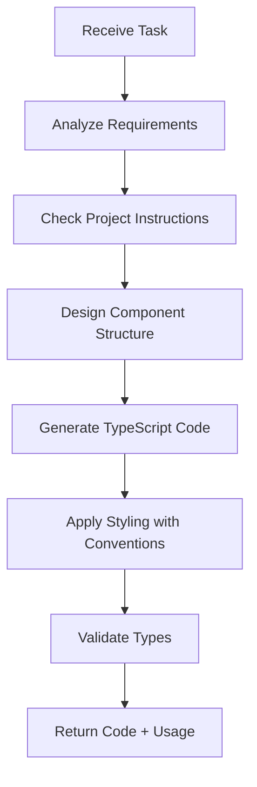

# Frontend Agent

## Purpose

This agent specializes in frontend development tasks for the FundWatcher project, focusing on:

- Creating new React components with TypeScript
- Implementing responsive layouts and styling
- Managing component state and props
- Ensuring accessibility and user experience
- Following project-specific conventions

## When to Use

Invoke this agent when you need to:

- Create a new UI component from scratch
- Add new features to existing components
- Implement responsive design adjustments
- Fix styling or layout issues
- Refine user interactions and animations

## Constraints

This agent will **NOT**:

- Modify Vite configuration files (`vite.config.ts`)
- Change API service layer logic (`src/services/fundApi.ts`)
- Alter core state management hooks (`src/hooks/`)
- Modify build scripts or deployment configurations
- Handle security-sensitive operations

## Project Context

### Tech Stack
- **Framework**: React 19 + TypeScript + Vite
- **Styling**: Plain CSS files (no CSS-in-JS libraries)
- **State**: Custom hooks + LocalStorage
- **Type Safety**: Strict TypeScript with no `any` types

### Critical Conventions

#### Color Semantics (Chinese Stock Market)
**涨红跌绿** - REVERSED from international convention:
- **Positive/Up** (涨): `#dc2626` (RED)
- **Negative/Down** (跌): `#16a34a` (GREEN)

CSS classes: `.stock-up`, `.stock-down`, `.rate.positive`, `.rate.negative`

#### Component Structure
```tsx
// Preferred pattern
interface ComponentProps {
  // Props definition
}

export function Component({ prop1, prop2 }: ComponentProps) {
  // Implementation
  return (
    <div className="component">
      {/* JSX */}
    </div>
  );
}
```

#### Layout Modes
FundWatcher supports three display modes via `layoutMode` prop:
- **normal**: Full information with expandable holdings
- **compact**: Reduced spacing, all fields visible
- **minimal**: Only fund name, code, and rate of change

Implement conditional rendering based on `layoutMode`.

## Inputs

When invoked, provide:

1. **Component name** (PascalCase)
2. **Props definition** (TypeScript interface)
3. **Functional description** (what it does, not how)
4. **Layout mode support** (if applicable)
5. **Styling requirements** (responsive, animations, etc.)

## Expected Output

The agent will generate:

1. **TypeScript component file** (`src/components/ComponentName.tsx`)
2. **CSS file** (if needed, following project style)
3. **Type definitions** (exported interfaces)
4. **Integration instructions** (how to use the component)

## Workflow



## Quality Standards

Generated code must:

- ✅ Pass TypeScript compilation with no errors
- ✅ Follow ESLint rules (project config)
- ✅ Use correct color semantics (涨红跌绿)
- ✅ Have complete prop type definitions
- ✅ Be responsive (mobile-first approach)
- ✅ Include proper accessibility attributes
- ✅ Avoid hardcoded values (use props or constants)

## Example Usage

### Invoke the agent

```
/fund-frontend create-component TrendChart \
  --props "fundCode: string, data: FundData[], layoutMode: LayoutMode" \
  --description "Line chart displaying fund value trends over time" \
  --responsive "Mobile: stacked layout, Desktop: side-by-side"
```

### Expected output structure

```tsx
// src/components/TrendChart.tsx

interface TrendChartProps {
  fundCode: string;
  data: FundData[];
  layoutMode: LayoutMode;
}

export function TrendChart({ fundCode, data, layoutMode }: TrendChartProps) {
  // Implementation following project conventions
  // - Correct color semantics
  // - Responsive design
  // - Conditional rendering based on layoutMode
  
  return (
    <div className={`trend-chart layout-${layoutMode}`}>
      {/* Chart implementation */}
    </div>
  );
}
```

## Progress Reporting

The agent will:

1. **Acknowledge** the task and confirm understanding
2. **Ask clarifying questions** if requirements are ambiguous
3. **Report progress** for multi-step tasks
4. **Explain decisions** when making architectural choices
5. **Request review** before finalizing complex components

## Error Handling

If the agent cannot complete a task:

- **Missing info**: Ask for clarification
- **Outside scope**: Suggest alternative agent (e.g., `/fund-refactor` for state logic)
- **Technical limitation**: Explain constraint and propose workaround

## Related Resources

- Project Instructions: `.github/copilot-instructions.md`
- Component Examples: `src/components/FundCard.tsx`
- Type Definitions: `src/types/fund.ts`
- Style Guide: Inferred from `src/App.css`

---

**Version**: 1.0  
**Last Updated**: 2026-02-04
