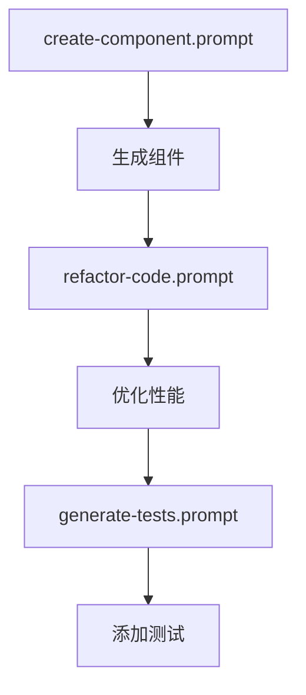
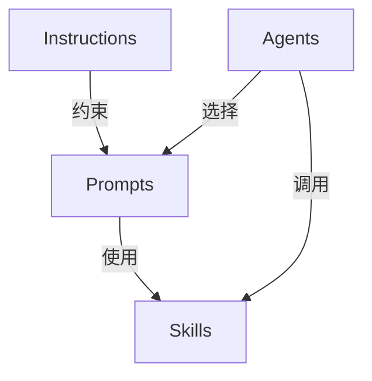

# Prompts - 任务模板

Prompts 是预定义的任务模板，封装了常见任务的完整需求描述，确保一致性和可复用性。

## 📋 可用 Prompts

### 1. Create Component
**文件**: [create-component.prompt.md](./create-component.prompt.md)

**用途**: 创建新的 React 函数组件

**包含内容**:
- 组件结构要求
- 样式规范
- 类型安全标准
- 完整示例
- 验证清单

**使用场景**: 需要创建符合项目规范的新组件时

---

### 2. Refactor Code
**文件**: [refactor-code.prompt.md](./refactor-code.prompt.md)

**用途**: 重构现有代码（提取 Hook、优化性能、改进结构）

**包含内容**:
- 重构原则
- 常见模式（Extract Hook、Optimize Performance 等）
- 前后对比示例
- 安全检查清单
- 变更总结模板

**使用场景**: 代码需要重构或优化时

---

### 3. Generate Tests
**文件**: [generate-tests.prompt.md](./generate-tests.prompt.md)

**用途**: 生成单元测试（组件、Hook、工具函数）

**包含内容**:
- 测试结构（Arrange-Act-Assert）
- 测试原则（行为而非实现）
- 覆盖目标（Happy Path、Edge Cases、错误处理）
- 完整测试示例
- 测试清单

**使用场景**: 需要补充测试覆盖率时

---

## 🔧 Prompt 工作原理


### Prompt vs 直接描述需求

| 方式 | 优点 | 缺点 |
|------|------|------|
| 使用 Prompt | 一致性高、节省时间、包含最佳实践 | 需要预先定义 |
| 直接描述 | 灵活、无需准备 | 每次描述不一致、易遗漏细节 |

---

## 📐 创建新 Prompt

### 文件格式

```markdown
---
description: 'Prompt 简要描述'
---

# Prompt Title

## Task
任务的简要说明

## Requirements
详细需求列表

## Parameters
所需参数及说明

## Example Usage
实际使用示例（用户如何调用）

## Expected Output
期望的输出格式和内容

## Validation Checklist
验证清单
```

### 命名约定

- 文件名: `action-target.prompt.md`（动词-名词）
- Prompt 标题: 清晰描述任务
- 示例: `create-component.prompt.md`, `refactor-code.prompt.md`

---

## 🎯 设计原则

### 1. 完整性

**好的 Prompt 包含**:
- ✅ 明确的任务描述
- ✅ 详细的需求列表
- ✅ 具体的参数说明
- ✅ 丰富的示例
- ✅ 验证清单

**避免**:
- ❌ 模糊的描述
- ❌ 缺少示例
- ❌ 没有验证标准

---

### 2. 可参数化

**好的参数设计**:
```markdown
## Parameters
- **componentName** (required): PascalCase 组件名
- **props** (required): TypeScript props 定义
- **description** (optional): 功能描述
- **layoutMode** (optional): 是否支持布局模式
- **hasInteraction** (optional): 是否有用户交互
```

**避免**:
```markdown
## Parameters
一些参数（具体看情况）
```

---

### 3. 示例驱动

**好的示例**:
```markdown
## Example Usage

任务: 创建一个基金统计组件

要求:
- 显示总数、平均涨跌幅、最佳/最差基金
- 支持三种布局模式
- 使用正确的颜色语义
- 响应式设计

期望输出:
[完整的代码示例]

验证:
- [ ] TypeScript 编译通过
- [ ] 颜色语义正确
- [ ] 响应式布局生效
```

---

## 📝 使用示例

### 示例 1: 使用 Create Component Prompt

**用户输入**:
```
使用 create-component prompt 创建 FundStatistics 组件:
- props: funds: FundData[], layoutMode: LayoutMode
- 显示总数、平均涨跌幅、最佳/最差基金
- minimal 模式只显示总数和平均值
- 使用涨红跌绿颜色
```

**Copilot 行为**:
1. 加载 `create-component.prompt.md`
2. 应用 Prompt 中的所有要求
3. 结合用户参数生成代码
4. 返回符合规范的组件

---

### 示例 2: 使用 Refactor Code Prompt

**用户输入**:
```
使用 refactor-code prompt 重构 FundCard.tsx:
- 提取持仓展开逻辑到 useHoldingsExpansion hook
- 保持组件行为不变
```

**Copilot 行为**:
1. 加载 `refactor-code.prompt.md`
2. 遵循重构原则（单一职责、类型安全等）
3. 生成新 Hook 和更新的组件
4. 提供变更总结和验证步骤

---

### 示例 3: 使用 Generate Tests Prompt

**用户输入**:
```
使用 generate-tests prompt 为 FundCard 生成测试:
- 覆盖所有 layoutMode 变体
- 测试涨跌颜色正确性
- 测试持仓展开交互
- 包含边界情况（空数据）
```

**Copilot 行为**:
1. 加载 `generate-tests.prompt.md`
2. 遵循测试原则（AAA 模式、测试行为等）
3. 生成完整测试文件
4. 创建 mock 数据工具（如需要）

---

## 🔍 Prompt 质量标准

### 高质量 Prompt 的特征

1. **清晰的任务定义**:
   - 一句话说明任务目标
   - 明确任务边界

2. **详尽的需求列表**:
   - 结构要求
   - 样式规范
   - 类型安全
   - 错误处理

3. **参数化设计**:
   - 必选参数清晰
   - 可选参数有默认行为
   - 参数类型明确

4. **丰富的示例**:
   - 典型用例
   - 边界情况
   - 复杂场景

5. **可验证性**:
   - 验证清单
   - 自动检查项
   - 人工审查要点

---

## 📊 Prompt 维护

### 何时更新 Prompt？

当发现：
- 生成的代码频繁需要相同的修正
- 项目规范发生变化
- 新的最佳实践出现
- 用户反馈不满足需求

### 如何更新？

1. **更新需求列表**: 添加缺失的规范
2. **增强示例**: 添加新场景的示例
3. **完善验证清单**: 包含新的检查项
4. **记录变更**: 说明更新原因和影响

**更新示例**:
```markdown
# Changelog

## v1.1 (2026-02-10)
- 添加: 要求所有组件包含 ARIA 标签
- 更新: 颜色语义示例更详细
- 修复: 验证清单遗漏响应式设计检查

## v1.0 (2026-02-04)
- 初始版本
```

---

## 🛠️ Prompt 组合使用

Prompts 可以组合使用，形成完整的工作流：

### 工作流示例: 创建新功能



**实际操作**:
```bash
# 步骤 1: 创建组件
使用 create-component prompt 生成 TrendChart

# 步骤 2: 优化性能（如果需要）
使用 refactor-code prompt 优化 TrendChart 性能

# 步骤 3: 添加测试
使用 generate-tests prompt 为 TrendChart 生成测试
```

---

## 📚 Prompt 与其他概念的关系



- **Instructions**: 定义全局规则，Prompts 必须遵循
- **Skills**: Prompts 内部可能引用 Skills
- **Agents**: Agents 根据任务选择合适的 Prompt

---

## 📚 相关文档

- [Agents 说明](../agents/README.md)
- [Skills 说明](../skills/README.md)
- [使用规范](../COPILOT_USAGE_GUIDE.md)
- [项目 Instructions](../copilot-instructions.md)

---

**维护者**: 任何开发者（常见任务可提交 PR）  
**更新频率**: 按需更新（发现新模式或规范变化时）
