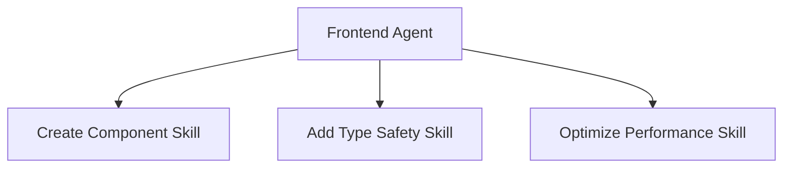

# Skills - 可复用技能模块

Skills 是明确定义输入输出规范的可复用能力模块，类似于函数或工具。Agent 可以调用 Skills 来完成特定任务。

## 📋 可用 Skills

### 1. Create Component
**文件**: [create-component.skill.md](./create-component.skill.md)

**功能**: 生成符合项目规范的 React 函数组件

**输入**:
- `componentName` (string): 组件名称（PascalCase）
- `props` (object): Props 类型定义
- `description` (string): 功能描述
- `layoutMode` (boolean): 是否支持布局模式
- `responsive` (boolean): 是否需要响应式

**输出**:
- 完整的 `.tsx` 文件
- TypeScript 类型定义
- 基础样式结构

---

### 2. Extract Hook
**文件**: [extract-hook.skill.md](./extract-hook.skill.md)

**功能**: 从组件中提取逻辑到自定义 Hook

**输入**:
- `sourceFile` (string): 源组件文件路径
- `hookName` (string): Hook 名称（use 前缀）
- `logic` (string): 要提取的逻辑描述
- `returnValue` (string): Hook 返回值

**输出**:
- 新的 Hook 文件
- 更新的组件代码
- TypeScript 类型定义

---

### 3. Optimize Performance
**文件**: [optimize-performance.skill.md](./optimize-performance.skill.md)

**功能**: 优化 React 组件性能，减少不必要的渲染

**输入**:
- `componentFile` (string): 组件文件路径
- `issue` (string): 性能问题描述
- `target` (string): 优化目标（可选）

**输出**:
- 优化后的组件代码
- 性能分析报告
- 前后对比

**优化手段**:
- `React.memo`: 组件级别 memoization
- `useMemo`: 计算结果 memoization
- `useCallback`: 函数 memoization
- 代码分割和懒加载

---

### 4. Add Type Safety
**文件**: [add-type-safety.skill.md](./add-type-safety.skill.md)

**功能**: 增强 TypeScript 类型安全，添加 runtime 类型守卫

**输入**:
- `targetFile` (string): 目标文件路径
- `focus` (string): 关注点（API 响应、props、state 等）
- `addGuards` (boolean): 是否添加类型守卫

**输出**:
- 完整的类型定义
- Runtime 类型守卫函数
- 更新的代码
- 类型安全验证报告

---

## 🔧 Skill 工作原理


### Skill vs Prompt

| 特性 | Skill | Prompt |
|------|-------|--------|
| 定义 | 功能性工具 | 任务模板 |
| 输入输出 | 严格规范 | 灵活描述 |
| 调用方式 | Agent 调用 | 用户使用 |
| 复用性 | 高（组合使用） | 中（单独使用） |

---

## 📐 创建新 Skill

### 文件格式

```markdown
---
description: 'Skill 简要描述'
tools: []
---

# Skill Name

## Purpose
明确说明 Skill 的功能

## Inputs
- **param1** (type, required/optional): 描述
- **param2** (type, required/optional): 描述

## Output
输出内容和格式说明

## Rules
执行规则和约束

## Example
完整的输入输出示例

## Validation
质量检查标准
```

### 命名约定

- 文件名: `action-target.skill.md`（动词-名词）
- Skill 名称: 清晰描述功能
- 示例: `create-component.skill.md`, `extract-hook.skill.md`

---

## 🎯 设计原则

### 1. 单一职责

**好的 Skill**:
```markdown
# Create Component Skill

生成一个 React 函数组件
```

**避免**:
```markdown
# Mega Skill

创建组件、添加测试、优化性能、部署上线
```

### 2. 明确的输入输出

**好的定义**:
```markdown
## Inputs
- **componentName** (string, required): PascalCase 组件名
- **props** (object, optional): Props 类型定义

## Output
完整的 .tsx 文件，包含：
1. TypeScript interface
2. 函数组件
3. Named export
```

**避免**:
```markdown
## Inputs
一些参数

## Output
生成代码
```

### 3. 可组合性

Skills 应该可以被 Agent 组合调用：



---

## 📝 使用示例

### 示例 1: 直接调用 Skill

虽然 Skills 主要由 Agent 调用，但也可以直接使用：

```bash
# 使用 create-component skill
输入: 
{
  "componentName": "TrendChart",
  "props": {
    "fundCode": "string",
    "data": "FundData[]"
  },
  "responsive": true
}

输出:
src/components/TrendChart.tsx（完整的组件文件）
```

---

### 示例 2: Agent 调用 Skill

```bash
# 用户调用 Agent
/fund-frontend create-component TrendChart

# Agent 内部流程
1. 解析用户意图
2. 调用 create-component.skill
3. 应用 Instructions 规范
4. 返回生成的代码
```

---

## 🔍 Skill 验证

每个 Skill 应该定义验证标准：

### Create Component Skill 验证

- ✅ TypeScript 编译通过
- ✅ 使用 Named Export
- ✅ Props 有 TypeScript 类型
- ✅ 处理空状态
- ✅ 符合项目颜色语义

### Extract Hook Skill 验证

- ✅ Hook 名称以 `use` 开头
- ✅ 所有参数和返回值有类型
- ✅ 使用 `useCallback` 包装函数
- ✅ 组件行为不变
- ✅ Hook 可独立测试

---

## 📊 Skill 质量标准

### 高质量 Skill 的特征

1. **完整的文档**: 
   - 清晰的描述
   - 详细的输入输出
   - 实用的示例

2. **严格的规范**:
   - 输入验证
   - 输出格式一致
   - 错误处理

3. **可测试性**:
   - 确定性输出
   - 明确的验证标准
   - 易于验证

4. **可维护性**:
   - 单一职责
   - 清晰的规则
   - 可扩展设计

---

## 🛠️ 扩展现有 Skill

### 何时扩展？

当发现：
- 同一个 Skill 重复被请求添加新功能
- 现有参数不够灵活
- 输出格式需要更多选项

### 如何扩展？

1. **添加可选参数**（而非改变现有参数）
2. **保持向后兼容**（默认值维持原行为）
3. **更新示例**（展示新功能）
4. **更新验证标准**（包含新场景）

**示例**:
```markdown
# Before
## Inputs
- **componentName** (string, required)
- **props** (object, optional)

# After (扩展)
## Inputs
- **componentName** (string, required)
- **props** (object, optional)
- **withTests** (boolean, optional): 是否同时生成测试文件
- **storybook** (boolean, optional): 是否生成 Storybook 故事
```

---

## 📚 相关文档

- [Agents 说明](../agents/README.md)
- [Prompts 说明](../prompts/README.md)
- [使用规范](../COPILOT_USAGE_GUIDE.md)
- [项目 Instructions](../copilot-instructions.md)

---

**维护者**: 高级开发者（发现可复用模式时添加）  
**更新频率**: 按需更新（发现新模式时）
